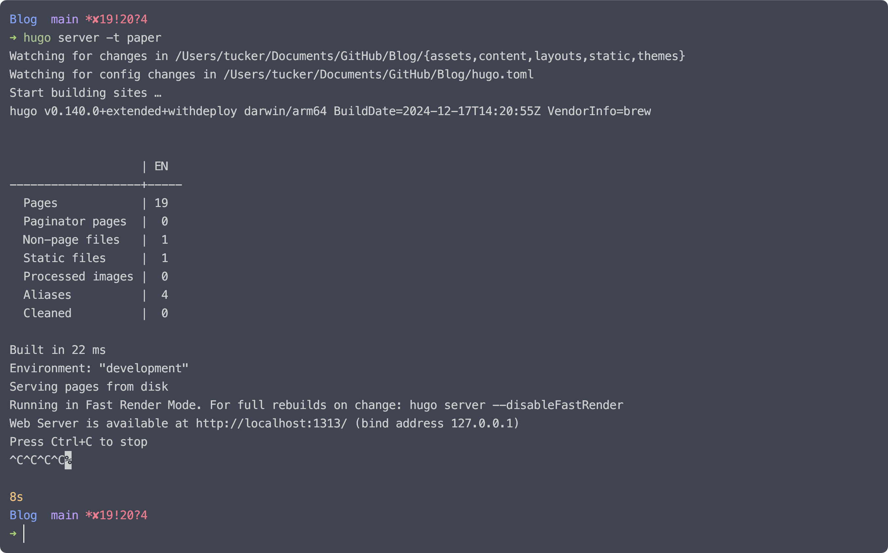

# Overview
This post explores setting up a Blog with Obsidian & Hugo, discussing key concepts and practical applications.



# Setting Up the Vault

```bash
ln -sf /Users/tucker/Documents/GitHub/Blog/content/Blog-Posts ~/Documents/00-Vault/00\ -\ Inbox/07\ -\ BLOG
ln -sf /Users/tucker/Documents/GitHub/Blog/content/Blog-Attachments ~/Documents/00-Vault/00\ -\ Inbox/07\ -\ BLOG
```

https://github.com/zoni/obsidian-export/?tab=readme-ov-file#relative-links-with-hugo


---
